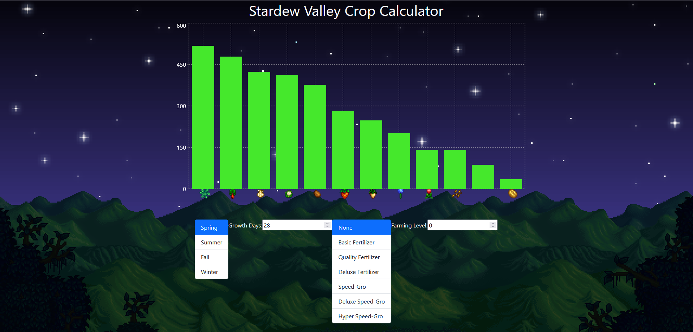

# Stardew Valley Crops Profit Calculator

React and TypeScript data visualization project that renders a bar chart of crop sell values from the farming simulator game Stardew Valley.

The user can input values corresponding to in-game stats to update how the bar chart renders the sell prices of the crops. Using an averaging equation based on the in-game selling price mechanics, the user can input player farming level, fertilizer choices, and amount of days given for the crop to grow to figure out what the most profitable crop to plant would be.

The chart also allows the switching of seasons to test which crop in which season would be best.

# Stardew Valley Crops Profit Calculator

## Introduction

Welcome to the Stardew Valley Crops Profit Calculator! This React and TypeScript data visualization project helps players of the popular farming simulator game, Stardew Valley, to calculate the most profitable crops to plant. By considering various in-game factors like farming level, fertilizer choices, and growth periods, this tool renders an interactive bar chart to guide your farming decisions effectively.

## Technologies Used

React
TypeScript
[Any other libraries or frameworks used]

## Features

Interactive Bar Chart: Visualizes crop sell values based on user input.
Customizable Inputs: Allows players to input farming level, fertilizer choices, and growth days.
Seasonal Analysis: Switch between seasons to determine the best crops for each period.
Averaging Equation: Implements an in-game sell price mechanic to calculate profit.

## Installation and Setup

Clone the repository: git clone [repository URL]
Navigate to the project directory: cd stardew-valley-crops-profit-calculator
Install dependencies: npm install
Start the application: npm start
Open http://localhost:3000 in your browser to view the application.

## Usage

To use the calculator:

Enter your player's farming level.
Select your fertilizer choice.
Input the number of days you plan to grow the crop.
View the bar chart for profit analysis.
Switch between seasons to compare profits.

## Screenshots

## Contact

For any queries or suggestions, feel free to reach out at hakeemshibly@gmail.com.
